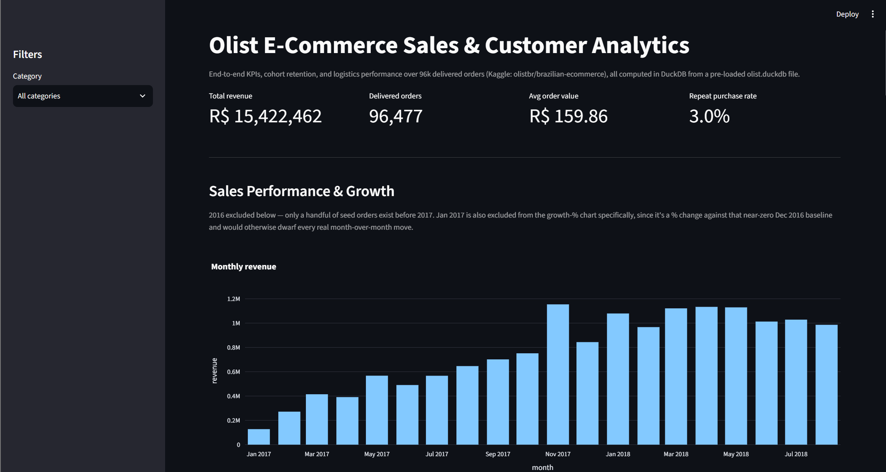
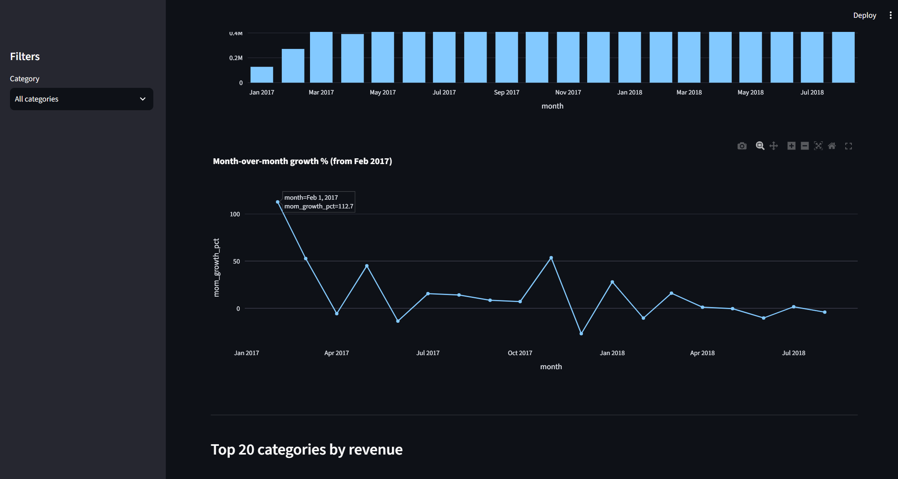
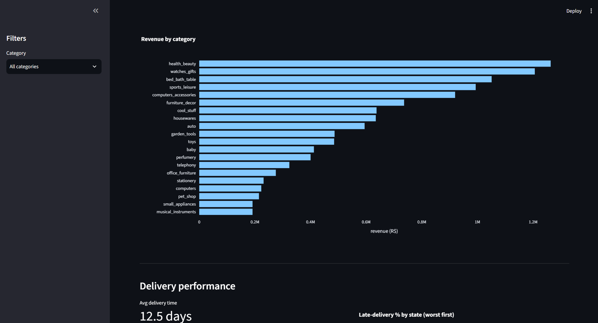
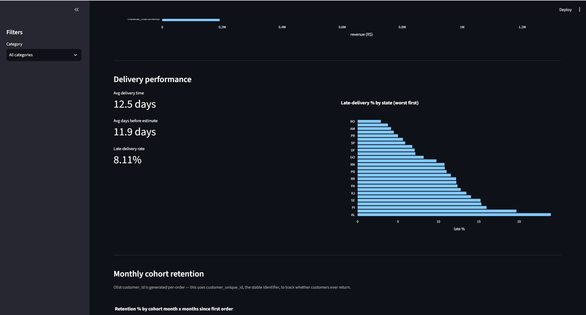
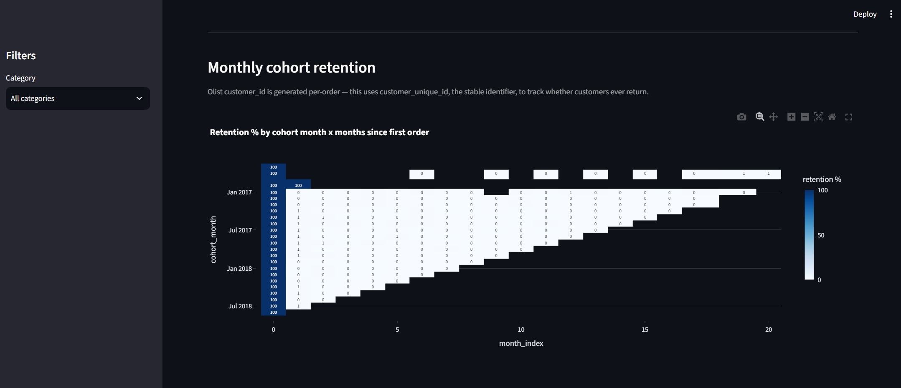
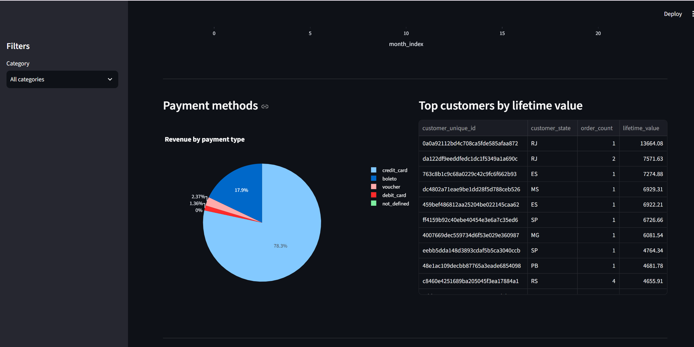

# Olist E-Commerce Sales & Customer Analytics

An end-to-end data analytics project analyzing the Olist Brazilian E-Commerce dataset using SQL, DuckDB, Python, and Streamlit.

The project focuses on **sales performance, customer behavior, product categories, delivery operations, payment methods, and customer retention**.

---

## Dashboard Preview


The interactive dashboard combines business KPIs, revenue trends, category performance, delivery analytics, customer retention, payment analysis, and customer lifetime value.

---

## Business Questions

This project answers the following business questions:

- How is revenue changing over time?
- Which product categories generate the most revenue?
- What is the average order value?
- How frequently do customers make repeat purchases?
- Which customer segments generate the most revenue?
- How does delivery performance vary across Brazilian states?
- Does late delivery affect customer review scores?
- Which payment methods generate the most revenue?
- How does customer retention change across monthly cohorts?
- Which customers have the highest lifetime value?

---

## Key Performance Indicators

| KPI | Result |
|---|---:|
| Total Revenue | R$ 15.42M |
| Delivered Orders | 96,477 |
| Average Order Value | R$ 159.86 |
| Repeat Purchase Rate | 3.0% |
| Average Delivery Time | 12.5 days |
| Late Delivery Rate | 8.11% |

---

## Key Insights

### Sales Performance

Revenue increased substantially throughout 2017, reaching monthly revenue above **R$1M** during several periods in late 2017 and 2018.

The dashboard tracks both monthly revenue and month-over-month growth to identify changes in sales momentum.

### Customer Behavior

The majority of customers are one-time purchasers.

The analysis identifies:

- One-time customers
- Repeat customers
- Loyal customers
- Customer lifetime value
- Monthly cohort retention

This highlights a significant opportunity for improving customer retention and repeat purchasing.

### Delivery Performance

Delivery performance varies considerably across Brazilian states.

The analysis also compares delivery status with customer review scores:

| Delivery Status | Orders | Avg. Review Score |
|---|---:|---:|
| On Time | 88,644 | 4.29 |
| Late | 7,826 | 2.57 |

Late deliveries are associated with substantially lower customer review scores, indicating that logistics performance is an important driver of customer satisfaction.

### Product Categories

Revenue is concentrated among a smaller group of product categories.

The dashboard ranks the top categories by revenue to identify the strongest contributors to overall sales.

### Payments

Payment behavior is analyzed by:

- Payment type
- Revenue contribution
- Installments
- Transaction volume

---

## Dashboard

The Streamlit dashboard provides interactive analysis across multiple business areas.

### Sales & Growth



### Product Category Analysis



### Delivery Performance



### Customer Cohort Retention



### Payment Analysis



### Customer Analysis



---

## Data Analysis

The project contains SQL queries covering:

### Sales Analysis

- Total revenue
- Order volume
- Average order value
- Monthly revenue
- Month-over-month growth
- Category revenue

### Customer Analysis

- Customer segmentation
- Repeat purchase rate
- Customer lifetime value
- Cohort retention
- Top customers

### Logistics Analysis

- Average delivery time
- Late delivery rate
- Delivery performance by state
- Delivery status vs. review score

### Payment Analysis

- Payment type distribution
- Revenue by payment method
- Installment analysis

---

## SQL Concepts Used

The project demonstrates practical SQL analytics techniques including:

- `INNER JOIN`
- `LEFT JOIN`
- Common Table Expressions (`CTEs`)
- `GROUP BY`
- `CASE WHEN`
- `HAVING`
- `DATE_TRUNC`
- `DATE_DIFF`
- `LAG`
- Window Functions
- Aggregations
- Conditional calculations

---

## Tech Stack

| Technology | Purpose |
|---|---|
| Python | Data analysis and application logic |
| SQL | Business analysis and transformations |
| DuckDB | Analytical database |
| Pandas | Data manipulation |
| Plotly | Interactive visualizations |
| Streamlit | Interactive dashboard |
| Jupyter Notebook | Exploratory analysis |
| Git & GitHub | Version control |

---

## Project Architecture

```text
Raw Olist CSV Data
        |
        v
load_to_duckdb.py
        |
        v
DuckDB Database
        |
        +------------------+
        |                  |
        v                  v
    queries.sql       analysis.ipynb
        |
        v
      db.py
        |
        v
     app.py
        |
        v
Streamlit Dashboard
